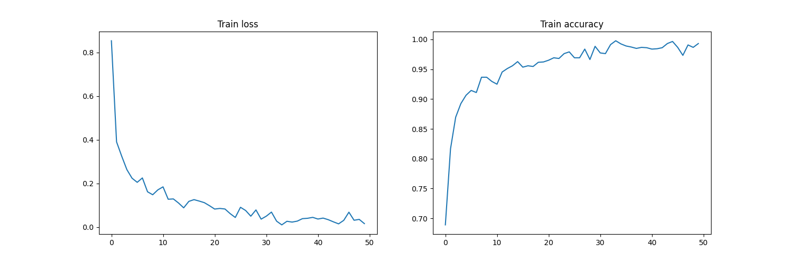
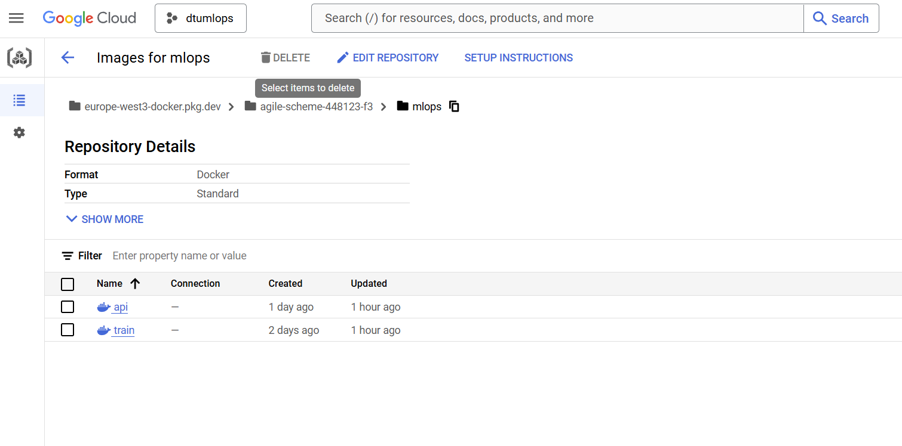
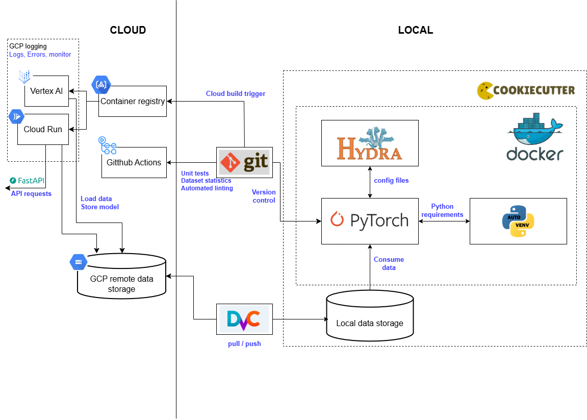

# Exam template for 02476 Machine Learning Operations

This is the report template for the exam. Please only remove the text formatted as with three dashes in front and behind
like:

```--- question 1 fill here ---```

Where you instead should add your answers. Any other changes may have unwanted consequences when your report is
auto-generated at the end of the course. For questions where you are asked to include images, start by adding the image
to the `figures` subfolder (please only use `.png`, `.jpg` or `.jpeg`) and then add the following code in your answer:

```markdown

```

In addition to this markdown file, we also provide the `report.py` script that provides two utility functions:

Running:

```bash
python report.py html
```

Will generate a `.html` page of your report. After the deadline for answering this template, we will auto-scrape
everything in this `reports` folder and then use this utility to generate a `.html` page that will be your serve
as your final hand-in.

Running

```bash
python report.py check
```

Will check your answers in this template against the constraints listed for each question e.g. is your answer too
short, too long, or have you included an image when asked. For both functions to work you mustn't rename anything.
The script has two dependencies that can be installed with

```bash
pip install typer markdown
```

## Overall project checklist

The checklist is *exhaustive* which means that it includes everything that you could do on the project included in the
curriculum in this course. Therefore, we do not expect at all that you have checked all boxes at the end of the project.
The parenthesis at the end indicates what module the bullet point is related to. Please be honest in your answers, we
will check the repositories and the code to verify your answers.

### Week 1

* [x] Create a git repository (M5)
* [x] Make sure that all team members have write access to the GitHub repository (M5)
* [x] Create a dedicated environment for you project to keep track of your packages (M2)
* [x] Create the initial file structure using cookiecutter with an appropriate template (M6)
* [x] Fill out the `data.py` file such that it downloads whatever data you need and preprocesses it (if necessary) (M6)
* [x] Add a model to `model.py` and a training procedure to `train.py` and get that running (M6)
* [x] Remember to fill out the `requirements.txt` and `requirements_dev.txt` file with whatever dependencies that you
    are using (M2+M6)
* [x] Remember to comply with good coding practices (`pep8`) while doing the project (M7)
* [X] Do a bit of code typing and remember to document essential parts of your code (M7)
* [x] Setup version control for your data or part of your data (M8)
* [x] Add command line interfaces and project commands to your code where it makes sense (M9)
* [x] Construct one or multiple docker files for your code (M10)
* [x] Build the docker files locally and make sure they work as intended (M10)
* [x] Write one or multiple configurations files for your experiments (M11)
* [x] Used Hydra to load the configurations and manage your hyperparameters (M11)
* [ ] Use profiling to optimize your code (M12)
* [x] Use logging to log important events in your code (M14)
* [ ] Use Weights & Biases to log training progress and other important metrics/artifacts in your code (M14)
* [ ] Consider running a hyperparameter optimization sweep (M14)
* [x] Use PyTorch-lightning (if applicable) to reduce the amount of boilerplate in your code (M15)

### Week 2

* [x] Write unit tests related to the data part of your code (M16)
* [ ] Write unit tests related to model construction and or model training (M16)
* [x] Calculate the code coverage (M16)
* [x] Get some continuous integration running on the GitHub repository (M17)
* [x] Add caching and multi-os/python/pytorch testing to your continuous integration (M17)
* [X] Add a linting step to your continuous integration (M17)
* [x] Add pre-commit hooks to your version control setup (M18)
* [x] Add a continues workflow that triggers when data changes (M19)
* [ ] Add a continues workflow that triggers when changes to the model registry is made (M19)
* [x] Create a data storage in GCP Bucket for your data and link this with your data version control setup (M21)
* [X] Create a trigger workflow for automatically building your docker images (M21)
* [X] Get your model training in GCP using either the Engine or Vertex AI (M21)
* [X] Create a FastAPI application that can do inference using your model (M22)
* [X] Deploy your model in GCP using either Functions or Run as the backend (M23)
* [ ] Write API tests for your application and setup continues integration for these (M24)
* [ ] Load test your application (M24)
* [ ] Create a more specialized ML-deployment API using either ONNX or BentoML, or both (M25)
* [ ] Create a frontend for your API (M26)

### Week 3

* [ ] Check how robust your model is towards data drifting (M27)
* [ ] Deploy to the cloud a drift detection API (M27)
* [X] Instrument your API with a couple of system metrics (M28)
* [ ] Setup cloud monitoring of your instrumented application (M28)
* [X] Create one or more alert systems in GCP to alert you if your app is not behaving correctly (M28)
* [ ] If applicable, optimize the performance of your data loading using distributed data loading (M29)
* [ ] If applicable, optimize the performance of your training pipeline by using distributed training (M30)
* [ ] Play around with quantization, compilation and pruning for you trained models to increase inference speed (M31)

### Extra

* [ ] Write some documentation for your application (M32)
* [ ] Publish the documentation to GitHub Pages (M32)
* [X] Revisit your initial project description. Did the project turn out as you wanted?
* [X] Create an architectural diagram over your MLOps pipeline
* [X] Make sure all group members have an understanding about all parts of the project
* [X] Uploaded all your code to GitHub

## Group information

### Question 1
> **Enter the group number you signed up on <learn.inside.dtu.dk>**
>
> Answer:

--- MLOPS 95 ---

### Question 2
> **Enter the study number for each member in the group**
>
> Example:
>
> *sXXXXXX, sXXXXXX, sXXXXXX*
>
> Answer:

s144463, s201700, s204426, s232773

### Question 3
> **A requirement to the project is that you include a third-party package not covered in the course. What framework**
> **did you choose to work with and did it help you complete the project?**
>
> Recommended answer length: 100-200 words.
>
> Example:
> *We used the third-party framework ... in our project. We used functionality ... and functionality ... from the*
> *package to do ... and ... in our project*.
>
> Answer:

We used several third-party frameworks during the development of out project. We used the PyTorch image models library (timm) for our modelling, using a pretrained resnet model from the same library which we then tuned to our data. Additionally we used pytorch lightning to decrease the amount of boilerplate needed in our code, and using its out the box functionality to more easily parameterize our training loops for various experiments. Pytorch lightning makes it easy to pipe params from hydra into our training loops without much effort. If we had gotten to a place were we were going to do multi gpu or multi node training, pytorch lightning would have shone particularly well.


## Coding environment

> In the following section we are interested in learning more about you local development environment. This includes
> how you managed dependencies, the structure of your code and how you managed code quality.

### Question 4

> **Explain how you managed dependencies in your project? Explain the process a new team member would have to go**
> **through to get an exact copy of your environment.**
>
> Recommended answer length: 100-200 words
>
> Example:
> *We used ... for managing our dependencies. The list of dependencies was auto-generated using ... . To get a*
> *complete copy of our development environment, one would have to run the following commands*
>
> Answer:

We managed the dependencies in our project using the pip package manager manually adding libraries to our requirements.txt and requirements_dev.txt files as we introduced dependencies during development. Dependencies were added with fixed versions to avoid issues with incompatability or different versions of libraries beeing pulled locally versus when building in cloud. The split of requirements into several files, is to distinguish libraries used exclusively for testing and development, from libraries needed for deployment. To setup our dev environment one must install python 3.11 and create a virtual environment, we used venv, as the conda ecosystem has become problematic since they changed their license to prohibit commercial usage. The simply installing the requirements files. And maybe install some build tools needed for python library binaries. Cloning the git repo, authorizing gcloud bucket access and running DVC pull should get the developer environment setup.

### Question 5

> **We expect that you initialized your project using the cookiecutter template. Explain the overall structure of your**
> **code. What did you fill out? Did you deviate from the template in some way?**
>
> Recommended answer length: 100-200 words
>
> Example:
> *From the cookiecutter template we have filled out the ... , ... and ... folder. We have removed the ... folder*
> *because we did not use any ... in our project. We have added an ... folder that contains ... for running our*
> *experiments.*
>
> Answer:

We have pretty much followed the cookiecutter template as stated in our README. However we have removed the notebooks directory as everything is operated by scripts. Outside version control some folders also exist, like the logs folder for logging each experiment execution, and persisting other logs of interest. Another local folder is temp, used to intermediate files, like the ones used for generating CML comments for github. Folders for data and model weights, and credentials are also outside version control. The src/mlops folder contains the core python code for our model, including its training and evaluation and the code needed to serve the model too, as well as some helper functions for stats visualisation and such. A .dvc folder for DVC configuration and cache has been added to the template too. We used the .github folder for all the github actions CICD flows. The configs folder contains the configurations for various training experiments as mangaged by hydra. All the docker files both for local and cloud deployment are kept in the dockerfiles folder. We have the docs folder with the specs to generate the docs site. Finally we have the tests folder containing all the unit tests.

### Question 6

> **Did you implement any rules for code quality and format? What about typing and documentation? Additionally,**
> **explain with your own words why these concepts matters in larger projects.**
>
> Recommended answer length: 100-200 words.
>
> Example:
> *We used ... for linting and ... for formatting. We also used ... for typing and ... for documentation. These*
> *concepts are important in larger projects because ... . For example, typing ...*
>
> Answer:
We implemented both linting and formatting using ruff, implemented as both pre-commit hooks and CICD to enforce a common standard. Typing was also used for local checks but not implemented as continous integration. We added comments to our code where needed to make it more understandable and easy to follow. We tried to follow the pep8 guidelines, to have a standard format for our python code. In large projects, and more importantly, when multiple people and teams are involved, it's essential to have a guideline for writing and formatting code. These guidelines help standardize the code, making it easier to read, understand, and maintain, whether by new team members or by yourself after a long time away from the project.

## Version control

> In the following section we are interested in how version control was used in your project during development to
> corporate and increase the quality of your code.

### Question 7

> **How many tests did you implement and what are they testing in your code?**
>
> Recommended answer length: 50-100 words.
>
> Example:
> *In total we have implemented X tests. Primarily we are testing ... and ... as these the most critical parts of our*
> *application but also ... .*
>
> Answer:

In total we have implemented 13 tests. The tests focused on three specific parts of the code: data processing, model training and API handling. The first tests were used to confirm that all images had been properly resized, preprocessed and stored. The second set of tests was for the model. More specifically, we wrote tests for the model's forward pass, training step, and evaluation to ensure that they operated as expected. Finally, we implemented a few tests for the API endpoints to ensure the response integrity and proper error handling, as well as to check the accessibility of the metrics.

### Question 8

> **What is the total code coverage (in percentage) of your code? If your code had a code coverage of 100% (or close**
> **to), would you still trust it to be error free? Explain you reasoning.**
>
> Recommended answer length: 100-200 words.
>
> Example:
> *The total code coverage of code is X%, which includes all our source code. We are far from 100% coverage of our **
> *code and even if we were then...*
>
> Answer:

Overall summary

- **Total Statements:** 288
- **Total Missed:** 145
- **Overall Coverage:** 50%

Script summary

- **api.py:** 72%
- **data.py:** 50%
- **dataset_statistics.py:** 90%
- **evaluate.py:** 0%
- **model.py:** 64%
- **train.py:** 0%
- **utils.py:** 92%

Our project currently has a code coverage of 50%, which includes tests for data processing, model training, and API interactions. While achieving 100% coverage might seem ideal, it doesn’t guarantee an error-free codebase. Coverage metrics only indicate which lines of code were executed, but they don’t account for untested edge cases, unexpected inputs, or real-world conditions. We focused on implementing tests that were meaningful to our project and most useful during development. Once the project was more or less put together, we used experiments and code outputs to validate our code. This is not to say that the tests guarantee a completely error-free codebase, but they ensure that the functions and components we consider critical are tested. In conclusion we can say that achieving high coverage is important, but focusing on the quality and relevance of tests is even more crucial than just aiming for higher numbers.

### Question 9

> **Did you workflow include using branches and pull requests? If yes, explain how. If not, explain how branches and**
> **pull request can help improve version control.**
>
> Recommended answer length: 100-200 words.
>
> Example:
> *We made use of both branches and PRs in our project. In our group, each member had an branch that they worked on in*
> *addition to the main branch. To merge code we ...*
>
> Answer:

We primarily worked on the main branch throughout our project due to the fast-paced nature of our project and almost always beeing in constant and direct contact. This approach allowed us to rely on each other's pushes in real time, ensuring we could quickly iterate and build on one another's contributions without delays.

While working directly on the main branch worked for us in this context, it’s worth noting that professional environments often rely on branches and pull requests as a best practice. Branches are used to encapsulate different features or versions of a project, isolating changes to ensure the main branch remains stable, and prevent things like system-breaking conflicts.

And although we didn’t strictly use branches and PRs, this practice might have been helpful for organization and quality control, like preventing merges that don't passs CICD checks. Worth noting though, that even some professional teams opt to work on a single branch, relying on small, incremental commits and feature flags to maintain stability. Git workflows can vary substantially based on a teams preferences and goals.

### Question 10

> **Did you use DVC for managing data in your project? If yes, then how did it improve your project to have version**
> **control of your data. If no, explain a case where it would be beneficial to have version control of your data.**
>
> Recommended answer length: 100-200 words.
>
> Example:
> *We did make use of DVC in the following way: ... . In the end it helped us in ... for controlling ... part of our*
> *pipeline*
>
> Answer:

Yes, we did use DVC for data management along the project, which greatly improved the workflow. At first we were downloading the data from Kaggle, but because it was breaking, we included DVC, which was hosted remotely hosted in a bucket. It is important to say, that since the data did not have versions and it was always the same, version control for that was not strictly necessary. However, a version contorl of the data would be very beneficial when storing efficiently and helping save storage. The DVC enhanced the reproducibility of the project, as anyone on the team is able to get the data using DVC.


### Question 11

> **Discuss you continuous integration setup. What kind of continuous integration are you running (unittesting,**
> **linting, etc.)? Do you test multiple operating systems, Python  version etc. Do you make use of caching? Feel free**
> **to insert a link to one of your GitHub actions workflow.**
>
> Recommended answer length: 200-300 words.
>
> Example:
> *We have organized our continuous integration into 3 separate files: one for doing ..., one for running ... testing*
> *and one for running ... . In particular for our ..., we used ... .An example of a triggered workflow can be seen*
> *here: <weblink>*
>
> Answer:

Our continuous integration is organized into 4 files specifying workflows in github actions: cml_data.yaml a workflow listening for changes on the .dvc directory or any other *.dvc files, such that when changes are made to the version controlled dataset, some summary statistics and examples from the dataset are compiled into a report which is then posted as a comment to the commit in github, allowing one to see how the changes affect the dataset. The codecheck.yaml file runs the ruff linter and formatter. For this project they are just run on push to the main branch, but in a real project they could be run on pull requests and made to prevent any merges unless they complete successfully, i.e. pass the checks. The pre-commit.yaml file runs some hooks, only basic ones for our case, like removing EOF and whitespace, checking for large files etc. but the pre-commit framework can offer a lot more checks if wanted too. The test_and_build.yaml file runs the unit test suite, builds the training and api docker images in GCP cloud build, pushes them to artifact registry and deploys the api image as a container to cloud run. The dependabot runs monthly suggesting library updates and finding potential security issues. We are using caching for pip so that libraries don't have to be pulled from the repo each time our workflows are run. We also make use of the matrix strategy in github, allowing us to run our tests on the permutations of several OS and python versions. An example of a triggered workflow using these features can be seen here <https://github.com/sebakeaaen/ml-ops-project/actions/runs/12942141464> which tests, builds and deploys our API for the pistachio classifier. Here is an example of CML adding a comment to a commit, when triggerede by changes in the dataset <https://github.com/sebakeaaen/ml-ops-project/commit/8441345d34e2f3defb831c1b577d6f8150a80f92>

## Running code and tracking experiments

> In the following section we are interested in learning more about the experimental setup for running your code and
> especially the reproducibility of your experiments.

### Question 12

> **How did you configure experiments? Did you make use of config files? Explain with coding examples of how you would**
> **run a experiment.**
>
> Recommended answer length: 50-100 words.
>
> Example:
> *We used a simple argparser, that worked in the following way: Python  my_script.py --lr 1e-3 --batch_size 25*
>
> Answer:

We used config files with hydra, and logged each experiment and its hyperparameters using CSV logging and pl.lightning. The code could then be executed as simply as: python train.py. Hyperparameters could be changed individually in the command line, or set to a entirely different preset config. At present, we have initialised 2 exp configs.

### Question 13

> **Reproducibility of experiments are important. Related to the last question, how did you secure that no information**
> **is lost when running experiments and that your experiments are reproducible?**
>
> Recommended answer length: 100-200 words.
>
> Example:
> *We made use of config files. Whenever an experiment is run the following happens: ... . To reproduce an experiment*
> *one would have to do ...*
>
> Answer:

As said in the previous question, every time the model is trained or evaluated, its hyperparameters are logged, as well as its performance. This helps keep track of the progress, and the configuration that lead to that specific performance. If a specific experiments needs to be reproduced, we can simply find it in the log folder, and use the hyperparameter file recorded in it. The default behaviour of logging also saves the model checkpoints for each experiment, which means saving the weights, biases etc. from the model during training. However, due to space constraints, we have elected to disable this behaviour for  now.

### Question 14

> **Upload 1 to 3 screenshots that show the experiments that you have done in W&B (or another experiment tracking**
> **service of your choice). This may include loss graphs, logged images, hyperparameter sweeps etc. You can take**
> **inspiration from [this figure](figures/wandb.png). Explain what metrics you are tracking and why they are**
> **important.**
>
> Recommended answer length: 200-300 words + 1 to 3 screenshots.
>
> Example:
> *As seen in the first image when have tracked ... and ... which both inform us about ... in our experiments.*
> *As seen in the second image we are also tracking ... and ...*
>
> Answer:

. We have chosen to keep it simple in this part, due to time constraints, as we would rather focus on other parts of the project. As seen in the picture, we have simply chosen to graph the testing of our model, which shows the loss and accuracy for each epoch. We see in the graph that the loss starts out high, but quickly drops down over the first 1-3 epochs. After this point, we see diminishing returns running aditional epochs. That is not to say that it is without cause however, as we still see some improvements all the way to epoch 50. The graph also reveals that the process is not entirely smooth, as the loss is slightly worsened some epochs, but the overall trend is still downwards.  This is all reflected in the training accuracy as well, as we see similar behaviour until epoch 50, with the same oscillations from epoch to epoch. To ensure that the last bit of performance improvements is not just overfitting, we of course also run a validation test at the end. Our separate validation testing shows that we are not entirely overfitting, as it performs at about 97% accuracy on the test set

### Question 15

> **Docker is an important tool for creating containerized applications. Explain how you used docker in your**
> **experiments/project? Include how you would run your docker images and include a link to one of your docker files.**
>
> Recommended answer length: 100-200 words.
>
> Example:
> *For our project we developed several images: one for training, inference and deployment. For example to run the*
> *training docker image: `docker run trainer:latest lr=1e-3 batch_size=64`. Link to docker file: <weblink>*
>
> Answer:

For our project we had primarily two images, one used for training in the cloud and one used for deploying our API. We also had a secondary training image we used to train locally pulling dvc data instead of mounting a bucket as a volume, which was also used while doing experimentation with version/vs non-version controlled buckets. The dockerfile used to deploy our API can be seen here as an example <https://github.com/sebakeaaen/ml-ops-project/blob/main/dockerfiles/api_cloud.dockerfile> When running this image one has to specificy the port env variable for local dev. e.g. : `docker run -p 8080:8080 -e PORT=8080 api:latest`

When running the training image one could also specify command line args like `--experiment.n_epochs=20` to customized training runs. Docker were primarily used to guarantee consistent behaviour across local dev and cloud deployment.

### Question 16

> **When running into bugs while trying to run your experiments, how did you perform debugging? Additionally, did you**
> **try to profile your code or do you think it is already perfect?**
>
> Recommended answer length: 100-200 words.
>
> Example:
> *Debugging method was dependent on group member. Some just used ... and others used ... . We did a single profiling*
> *run of our main code at some point that showed ...*
>
> Answer:

Debugging methods depended on the individual group member. While writing the model, not too many serious bugs occurred that required steping through with the debugger, as they were simply resolved with a walkthrough of the code (ensuring that the math and configuration options was configured as intended). This is also due to pytorch handling a lot of the boileplate. However for the api use was made, also of a remote debugger to analyze dimension of some faulty outputs, as well as stepping through the setting of some config params that were behaving unexpectedly.

In this project we chose not to focus on further code performance optimizations, since our model and code were pretty rudimentary and tested models, we would rather focus on other aspects. As such, profiling was not attempted. This does not mean that we expect the code to be perfect at all, but for our purposes and especially through the use of a gpu, it was fast enough.

## Working in the cloud

> In the following section we would like to know more about your experience when developing in the cloud.

### Question 17

> **List all the GCP services that you made use of in your project and shortly explain what each service does?**
>
> Recommended answer length: 50-200 words.
>
> Example:
> *We used the following two services: Engine and Bucket. Engine is used for... and Bucket is used for...*
>
> Answer:

We made use of the GCP cloud storage service creating buckets for version controlling our dataset and model weights. Cloud storage also works with Cloud build, which we utilized to build both our docker training images and api images, which got pushed to the service artifact registry. We used the Vertex AI service to train our model in the cloud. It is wrapper that allows for easy deployment of AI workloads, automatically mounting storage compute resources etc. In the end, a lot of the services are just wrappers for the same hypervisor. We used Cloud run to deploy our API as a service. We used Cloud logging to debug api deployments, and training and review telemetry in the form of logs. We used cloud monitoring to monitor the performance and uptime of our API. We used the Identity & Access Management service to manage resources and who could access them, e.g. creating service accounts for github actions, allowing permissions for everyone in the group.


### Question 18

> **The backbone of GCP is the Compute engine. Explained how you made use of this service and what type of VMs**
> **you used?**
>
> Recommended answer length: 100-200 words.
>
> Example:
> *We used the compute engine to run our ... . We used instances with the following hardware: ... and we started the*
> *using a custom container: ...*
>
> Answer:

As alluded to above we did not use the raw compute engine, but instead used several managed services to deploy our images. We used Vertex AI to train our model, although in practice the final model we trained on a local GPU, since Google never allocated one to us, but we did run a few examples with a few epochs on vertex, with a n1-highmem-2 machine which has specs as seen in the following link <https://gcloud-compute.com/n1-highmem-2.html>. Additionally we used the compute engine with the managed service cloud run, requesting a machine with 2Gi of memmory, corresponding to 1 vCPU according to this link <https://cloud.google.com/run/docs/configuring/services/memory-limits#:~:text=2%20GiB,1%20vCPU>. We will also have used the engine when building etc. but the exact VMs, or rather containers probably, spun up for these purposes we have not investigated. Again a lot of these services are just wrappers for the same hypervisor or container orchestrator, which is also a reason cloud infra as a business model works, you can allocate resources virtually as demand fluctuates.

### Question 19

> **Insert 1-2 images of your GCP bucket, such that we can see what data you have stored in it.**
> **You can take inspiration from [this figure](figures/bucket.png).**

> Answer:
We used seperate containers for version controlling the dataset and training the model / deploying the API. This was because the version aware bucket setup did not work for us using DVC. DVC are also discontinuing the support for the version aware remotes <https://github.com/iterative/dvc/issues/10306#:~:text=Unfortunately%2C%20I%20don%27t%20see%20a%20quick%20fix%2C%20and%20we%20are%20moving%20towards%20dropping%20support%20for%20version%2Daware%20remotes%20due%20to%20lots%20of%20small%20issues%20and%20inconsistencies%20like%20this%20one%2C%20so%20I%20am%20going%20to%20close%20this%20and%20suggest%20using%20traditional%20remotes%20to%20avoid%20these%20problems.>

So for the dataset we used classical remote, which stores the hashed diffs explicitly, and created a spereate bucket to use, which gets auto mounted when using managed services like vertex and cloud run.


### Question 20

> **Upload 1-2 images of your GCP artifact registry, such that we can see the different docker images that you have**
> **stored. You can take inspiration from [this figure](figures/registry.png).**
>
> Answer:



### Question 21

> **Upload 1-2 images of your GCP cloud build history, so we can see the history of the images that have been build in**
> **your project. You can take inspiration from [this figure](figures/build.png).**
>
> Answer:


### Question 22

> **Did you manage to train your model in the cloud using either the Engine or Vertex AI? If yes, explain how you did**
> **it. If not, describe why.**
>
> Recommended answer length: 100-200 words.
>
> Example:
> *We managed to train our model in the cloud using the Engine. We did this by ... . The reason we choose the Engine*
> *was because ...*
>
> Answer:

We did manage to train our model using vertex AI although only using CPUs as google would not assign us the resources: "We have received your quota request for agile-scheme-448123-f3 Unfortunately, we are unable to grant you additional quota at this time". We did it by setting up a docker image for training in the cloud which got built and pushed to artifact registry when pushing it to our github repo Then setting up a config file vertex_config.yaml which got passed to gcloud cli when "gcloud ai custom-jobs create -config=vertex_config.yaml --..." Then we also pointed the model and training loop to the buckets referenced above, by overriding the hydra params using command line args. The gcp buckets get mounted automatically with the vertex ai service.

## Deployment

### Question 23

> **Did you manage to write an API for your model? If yes, explain how you did it and if you did anything special. If**
> **not, explain how you would do it.**
>
> Recommended answer length: 100-200 words.
>
> Example:
> *We did manage to write an API for our model. We used FastAPI to do this. We did this by ... . We also added ...*
> *to the API to make it more ...*
>
> Answer:

Yes we managed to write an API for our model. We created a FastAPI-based application to perform the image classification using our resnet model. The API handles requests to classify uploaded images and also provides metrics for monitoring its performance. A custom lifespan manager was created which initializes and cleans up the model, which runs on either a GPU or CPU depending on availability. The /classify/ endpoint processes uploaded images by resizing, normalizing, and converting them into a format suitable for the model. It predicts the image's class and returns the result with confidence scores. Prometheus metrics, including counters and histograms, track requests, errors, and latency, providing insights into the application's performance and reliability.

### Question 24

> **Did you manage to deploy your API, either in locally or cloud? If not, describe why. If yes, describe how and**
> **preferably how you invoke your deployed service?**
>
> Recommended answer length: 100-200 words.
>
> Example:
> *For deployment we wrapped our model into application using ... . We first tried locally serving the model, which*
> *worked. Afterwards we deployed it in the cloud, using ... . To invoke the service an user would call*
> *`curl -X POST -F "file=@file.json"<weburl>`*
>
> Answer:

We did deploy it into cloud. First we dockerized the application making sure to expose the ports needed for cloud run using environment envs. Then ran this locally testing the endpoints. Once this was running satisfactorily we added it to our CICD pipeline, such that when pushed to our repo the api image gets built and pushed to GCP, and cloud run gets called to deploy the image. cludbuild.yaml contains the args used to call cloud run, like increasing the memmory, since deployment failed for the standard memmory allocation, and allowing unauthenticated access e.g.

/classify endpoint could be invoked e.g.:

`curl -X 'POST' \ 'https://pistachio-api-266814087920.europe-west3.run.app/classify/' \ -H 'accept: application/json' \ -H 'Content-Type: multipart/form-data' \ -F 'data=@data/raw/Pistachio_Image_Dataset/Pistachio_Image_Dataset/Kirmizi_Pistachio/kirmizi (2).jpg'`

/metrics endpoint could be invoked e.g.:

`curl -X 'POST' \ 'https://pistachio-api-266814087920.europe-west3.run.app/metrics/' \ -H 'accept: application/json'`

### Question 25

> **Did you perform any unit testing and load testing of your API? If yes, explain how you did it and what results for**
> **the load testing did you get. If not, explain how you would do it.**
>
> Recommended answer length: 100-200 words.
>
> Example:
> *For unit testing we used ... and for load testing we used ... . The results of the load testing showed that ...*
> *before the service crashed.*
>
> Answer:
As mentioned previously we performed unit testing of our API using the pytest framework, which allowed us to verify the correct functioning of key endpoints such as /classify/ and /metrics/.

We did not not load test our API due to time constraint. However, to load test this API we would use Locust. First we would prepare a set of sample images in the correct format and ensure they mimic real-world inputs. Then use a test script to send multiple POST requests to the /classify/ endpoint with the sample images as payloads.

We would start with a small number of users and gradually increase concurrency to simulate high-traffic conditions. While doing this we would keep an eye on key performance metrics like response time, throughput, error rate, and resource utilization. Monitor Prometheus metrics (/metrics endpoint) to validate latency and error tracking. Finally, identify bottlenecks (e.g., preprocessing or inference) and test the API's behavior under sustained load and stress conditions.

### Question 26

> **Did you manage to implement monitoring of your deployed model? If yes, explain how it works. If not, explain how**
> **monitoring would help the longevity of your application.**
>
> Recommended answer length: 100-200 words.
>
> Example:
> *We did not manage to implement monitoring. We would like to have monitoring implemented such that over time we could*
> *measure ... and ... that would inform us about this ... behaviour of our application.*
>
> Answer:

We managed to use GCP own monitoring tools, we did not manage to deploy a sidecar for our custom metrics. However we became familiar with the GCP monitoring of services and setup SLOs with alarms that would send emails, if e.g. latency increased beyond acceptable levels. In the broad scheme of things we only managed to setup up very basic monitoring. In a production setting monitoring is a crucial and hard problem, and the key to sucessfully operating a lot of infrastructure. Getting monitoring right, so it reflects the user experience of interacting with the api, to manage costs, to catch model issues like drift, to catch bad actors interacting with the endpoint, resoource issues, etc. Particularly setting up alerts that are sensitive enough to were they catch issues, but don't fire often enough to were they become meaningless, is hard.

## Overall discussion of project

> In the following section we would like you to think about the general structure of your project.

### Question 27

> **How many credits did you end up using during the project and what service was most expensive? In general what do**
> **you think about working in the cloud?**
>
> Recommended answer length: 100-200 words.
>
> Example:
> *Group member 1 used ..., Group member 2 used ..., in total ... credits was spend during development. The service*
> *costing the most was ... due to ... . Working in the cloud was ...*
>
> Answer:


Figure above gives an overview of spent credit which is quite miniscule. 13.62 DKK. The majority of the cost is seen to be Artifact registry followed by cloud storage. Most likely since we have had a lot of build pulling data from cloud storage and using cloud build and pushing images. We have not served very many request on our api or trained very much on vertex ai, due to the missing GPU allocation, hence the low cost. However, in a real world scenario compute costs would be expected to exceed storage, particularly because large sweeps of hyperparameters would be resource intensive, as would be serving inference requests on the model, as they require fairly large machines to operate. Not withstanding that actual GPU usage, which would be needed is expensive comparatively.

### Question 28

> **Did you implement anything extra in your project that is not covered by other questions? Maybe you implemented**
> **a frontend for your API, use extra version control features, a drift detection service, a kubernetes cluster etc.**
> **If yes, explain what you did and why.**
>
> Recommended answer length: 0-200 words.
>
> Example:
> *We implemented a frontend for our API. We did this because we wanted to show the user ... . The frontend was*
> *implemented using ...*
>
> Answer:

We have not implemented anything ekstra.

### Question 29

> **Include a figure that describes the overall architecture of your system and what services that you make use of.**
> **You can take inspiration from [this figure](figures/overview.png). Additionally, in your own words, explain the**
> **overall steps in figure.**
>
> Recommended answer length: 200-400 words
>
> Example:
>
> *The starting point of the diagram is our local setup, where we integrated ... and ... and ... into our code.*
> *Whenever we commit code and push to GitHub, it auto triggers ... and ... . From there the diagram shows ...*
>
> Answer:




The diagram above represents a system that integrates both local and cloud components to support our projects workflows, which are built around PyTorch models. Focusing on the local side of the diagram, the the big picture makes use of Cookiecutter and Docker. On one hand, Cookiecutter is used because it provides a template to organize the project, on the other hand, Docker makes sure that all dependencies are packaged in containers, which allows project to run consistently across different environments. That makes the project more reproducible. Focusing on the libraries requirements inside virtual environments, we used Python's AutoVen. With that, we made sure that the correct libraries and versions wereinstalled, so we avoided any possible dependancies issues. Concerning different configuration management, we decided to use Hydra, as it simplifies the handling of multiple configuration files, which is key to manage different setups in the project. The core of the project is built around PyTorch, which reads local data stored in the system's local storage for model training and inference. Then the DVC (Data Version Control) is used to control the datasets and maintain them synchronized them between the local and the cloud environments.

The cloud side of the architecture uses several tools and services to provide efficient workflows. We used Git and GitHub Actions as the core of version control and continuous integration. GitHub Actions automates key processes, which include unit tests, dataset statistics validation, and code linting every time new code is pushed or merged, which guarantees that the quality of the code is maintained. In order to maintain our data synchronized between the local and the cloud environments,we used DVC (Data Version Control), which version-controls datasets, making them accessible remotely. The Google Cloud Platform (GCP) serves as the remote storage solution and also hosts the trained models. Then, FastAPI is used to deploy the models, providing an API endpoint hosted on Google Cloud Run for scalable, real-time model inference. Moving on, GCP’s Vertex AI is used for cloud-based training, where containerized models stored in the Container Registry are executed on the cloud. GCP’s logging services are also integrated to monitor and log essential information, such as system logs and errors, ensuring that potential issues during deployment are tracked and addressed.

This architecture effectively joins the local development environment with cloud-based deployment, which allowsa for a workflow to build, test, and deploy the project.

### Question 30

> **Discuss the overall struggles of the project. Where did you spend most time and what did you do to overcome these**
> **challenges?**
>
> Recommended answer length: 200-400 words.
>
> Example:
> *The biggest challenges in the project was using ... tool to do ... . The reason for this was ...*
>
> Answer:

In general getting familiar with the cloud platform took a little effort, since none of us have worked with GCP before. More broadly, in particular two areas were a source of pain. Managing permissions, building and deploying. Particularly understanding which permissions are needed to access which services in GCP is a struggle sometimes, especially if you are trying to adhere to a least priviliges principle. The naming of these roles and accesses is also not always intuitive. In a similar vein getting the syntax correct for some CLI and configs. In this regard gen AI was helpfull, but also did hallucinate mix up old/new/different APIs, and we did have to reference docs. In general doing stuff that had to build was also a big pain due to build times, since one would necessarily make errors, but testing the configs for the Github and GCP build tools took a long time waiting for build to fail, it is a slower process iterating on this. Finally for deployment of our API specifiaclly we did struggle with getting the correct ports open and understanding why it wouldn't deploy in a case were no logs were generated, but only vents from GCP revealed a OOM error was the culprit. To some degree a lot of the tasks were also a little hard to work on in parallel. We also spent a lot of time debugging DVC, before moving away from version controlled buckets to classic buckets, since these also inherently have issues and DVC is moving away from them as mentioned earlier.

### Question 31

> **State the individual contributions of each team member. This is required information from DTU, because we need to**
> **make sure all members contributed actively to the project. Additionally, state if/how you have used generative AI**
> **tools in your project.**
>
> Recommended answer length: 50-300 words.
>
> Example:
> *Student sXXXXXX was in charge of developing of setting up the initial cookie cutter project and developing of the*
> *docker containers for training our applications.*
> *Student sXXXXXX was in charge of training our models in the cloud and deploying them afterwards.*
> *All members contributed to code by...*
> *We have used ChatGPT to help debug our code. Additionally, we used GitHub Copilot to help write some of our code.*
> Answer:

Student s201700 was in charge setting up our dataset preprocessing, and the test suite for our code, as well as DVC.

Student s232773 set up environments, linting, docker containers, as well as monitoring and alerts on GCP.

Student s204426 setup the git structure, the model and its training, as well as hyperparameter config and logging.

Student S144463 setup CICD in github actions, api code and build/deploy in GCP.

All members in general contributed to the code, and cloud setup as we worked together a lot doing pair programming to figure things out.
We have used ChatGPT to help debug our code. Additionally, we used GitHub Copilot to help write some of our code.
